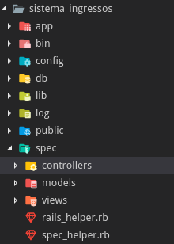
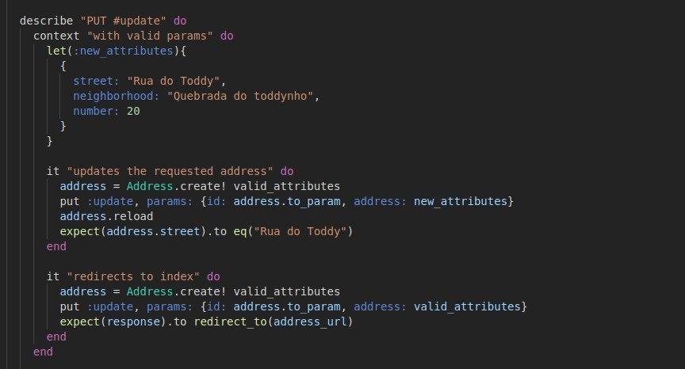
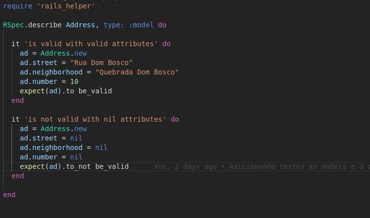

Este documento descreve o processo de testes, ferramente utilizada e comprova a utilização de ferramentas para os testes.

Giovanni M Guidini - 16/0122660
Gabriel Bessa      - 16/0120811 

# Descrição do Processo de Testes

Para os testes decidimos utilizar testes automatizados para testes unitários e testes manuais para integração. A integração foi testada por subsistema (i.e. subsistema de autenticação, subsistema de cadastramento de eventos, etc). O teste de sistema envolve todas as funcionalidades so sistema.

Como "unidade" utilizamos Models, Views e Controllers (os componentes do MVC). Isto é, cada Controller, Model e View foi testado individualmente através de testes unitários automatizados. Nesses testes foi utilizado o framework [Rspec](https://rspec.info/). Esse framework é voltado para desenvolvimento utilizando estilo TDD ou BDD, e acreditamos ter sido muito apropriado no desenvolvimento do sistema.

Nós utilizamos uma abordagem híbrida para integração do sistema, que foi feita por subsistemas relacionados, conforme comentado. Essa abordagem consistiu em integrar as partes relacionadas de um subsistema (M, V e C) e testá-los. Ao final desse processo todo o sistema pode ser integrado e o Smoke test realizado. Passado o smoke test podem ser realizados os testes de sistema mais rigorosos.

# Comprovação de Testes automatizados

Os testes automatizados foram os de unidade. Para esses testes foi utilizado o framework Rspec. Os arquivos de testes estão na pasta `spec` do projeto (ver figura abaixo). Note que existe uma pasta para os arquivos de teste dos Controllers, uma para Models e uma para Views.

Exemplos de casos de testes criados estão abaixo, para um controller e um model, respectivamente:

Finalmente, os casos de teste podem ser executados:

