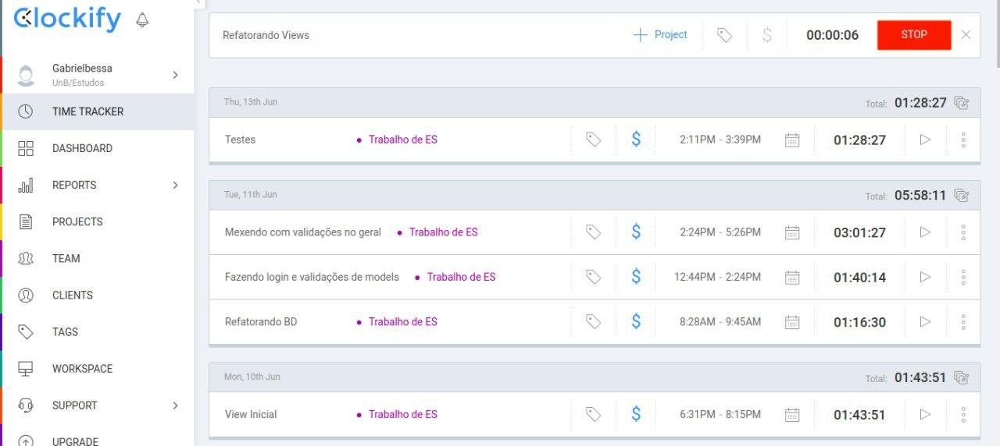

Este documento comenta sobre o processo de desenvolvimento utilizado para o sistema.

Giovanni M Guidini - 16/0122660
Gabriel Bessa      - 16/0120811 

# Processo utilizado

Para este processo nós utilizamos o modelo de processo em cascata. Esse modelo possui uma abordagem sequencial, onde cada atividade representa uma fase diferente do processo de desenvolvimento. Existe alguma intercalação e feedback entre as fases, mas em geral pode-se mais ou menos definir o início e final de uma fase.

As fases de desenvolvimento foram:
1. Definição de requisitos
2. Design do Sistema
3. Implementação e Testes de Unidade
4. Integração e Testes

Seguindo o planejamento de iterações definido no [plano de iteração](Item3_plano_iteracao.md), vemos que A primeira fase é realizada na semana 1; a segunda fase é realizada nas semanas 2 à 4; a terceira fase nas semanas 5 à 8; a última fase nas semanas 9 à 11.

# Justificativa do Processo

Decidimos utilizar este processo pois ele é simples de compreender e possui uma divisão clara de atividades a serem realizadas sequencialmente. Ele é melhor utilizado quando os requisitos são bem definidos e dificilmente mudarão, como era o nosso caso.

# Gerenciamento de Tempo

O tempo gasto em diversas atividades foi marcado com o auxílio da ferramenta Clockfy, para termos uma melhor noção de quanto tempo foi gasto nas fases gerais do projeto (veja figura abaixo).

