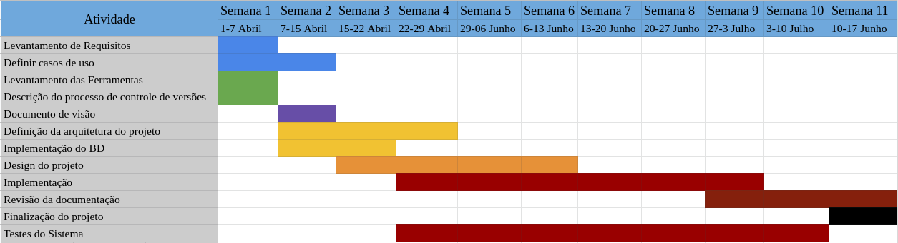

Este documento é o plano de projeto para o desenvolvimento do sistema de venda de ingressos que será o projeto de Engenharia de Software.

Giovanni M Guidini - 16/0122660
Gabriel Bessa	   - 16/

- [Introdução](#introdu%C3%A7%C3%A3o)
- [Organização do Projeto](#organiza%C3%A7%C3%A3o-do-projeto)
	- [Equipe](#equipe)
	- [Ferramentas](#ferramentas)
- [Análise de Risco](#an%C3%A1lise-de-risco)
- [Gerenciamento do Projeto](#gerenciamento-do-projeto)
- [Cronograma do Projeto](#cronograma-do-projeto)
	- [Cronograma do Projeto - Lista](#cronograma-do-projeto---lista)
			- [Semana 1 ( 1 ~ 7 abril)](#semana-1--1--7-abril)
			- [Semana 2 (7 ~ 15 de Abril)](#semana-2-7--15-de-abril)
			- [Semana 3~4 ( 15 ~ 29 abril)](#semana-34--15--29-abril)
			- [Semana 5~6 (29 abril ~ 13 maio)](#semana-56-29-abril--13-maio)
			- [Semana 7~8 (13 ~ 27 maio)](#semana-78-13--27-maio)
			- [Semana 9 (27 ~ 3 de junho)](#semana-9-27--3-de-junho)
			- [Semana 10~11 (3 ~ 17 junho)](#semana-1011-3--17-junho)
- [Controle de Qualidade](#controle-de-qualidade)
- [Referências](#refer%C3%AAncias)
  
# Introdução

O projeto de Engenharia de Software vai consistir em um sistema de venda de ingressos. Este projeto deverá estar disponível através da internet.

Esta versão do sistema deverá ser desenvolvida apenas para propósitos de demonstração, e não será colocada em produção para um público maior do que a sala de aula. O objetivo deste projeto é desenvolver os conhecimentos adquiridos em sala de aula sobre os processos relacionados à engenharia de software.

Para uma descrição mais detalhada do sistema, incluindo o escopo do projeto, consulte o [documento de visão](#blank) **Documento de visão ainda não foi feito**

Para uma descrição mais detalhada das features do sistema consulte o [documento de requisitos](item1_levantamento_de_requisitos.md)

# Organização do Projeto

## Equipe

A equipe do projeto será composta por 3 participantes: 
Giovanni M Guidini - 16/0122660
Gabriel Bessa	   - 16/

## Ferramentas

Para este projeto utilizaremos diversas ferramentas disponíveis na Internet para atingir fins específicos dentro do projeto. A lista completa de Ferramentas utilizadas pode ser consultada na [lista de ferramentas](Item6_lista_de_ferramentas.md)

# Análise de Risco

Os riscos neste projeto são considerador mínimos. Isso se deve principalmente ao escopo estar bem definido e a certeza de não haver mudança nos requisitos do projeto. Além disso o projeto em si não é muito inovador, existindo muitos sistemas nos quais podemos nos basear para auxiliar-nos na realização deste projeto.

A maior fonte de riscos identificada é a restrição de tempo. Os membros do grupo, ao longo do semestre, terão diversas outras atividades além do projeto, que podem complicar o andamento do mesmo.
Para evitar riscos desta natureza foi criado um cronograma de atividades para a realização do projeto, que deverá ser seguido da melhor maneira possível.

# Gerenciamento do Projeto
A metodologia de gerenciamento de projeto escolhida foi o Kanban. Kanban promotes continuous collaboration and encourages active, ongoing learning and improving by defining the best possible team workflow [2]. Esta metodologia está centrada em um _kanban board_: in software development, a visual representation of work for developers who pull tasks from the task backlog; used for on-demand or resource-bound scheduling [1].

Os princípios da metodologia Kanban [2] são:
- Visualize what you do today (workflow): seeing all the items in context of each other can be very informative
- Limit the amount of work in progress (WIP): this helps balance the flow-based approach so teams don€™t start and commit to too much work at once
- Enhance flow: when something is finished, the next highest thing from the backlog is pulled into play

Acreditamos que esta metologia será boa para nosso projeto principalmente em que ela (1) não define papéis específicos para os membros do time, e (2) por não ter sprints tão bem definidas, se adapta melhor à mudanças de tempo e demanda que outras metodologias.

# Cronograma do Projeto

O cronograma para o projeto está resumido no gráfico abaixo.

## Cronograma do Projeto - Lista
Abaixo o cronograma do projeto, separado em semanas, detalhando quais aspectos serão trabalhados em cada semana

#### Semana 1 ( 1 ~ 7 abril)
	- Levantamento de Requisitos
	- Levantamento das Ferramentas (item 6)
	- Descrição do processo de controle de versões (item 9)
	* Refinamento do plano de projeto no estilo Gantt Chart

#### Semana 2 (7 ~ 15 de Abril)
	- Documento de visão (item 4)
	- Começar a definir arquitetura do projeto (modelagem do BD e design geral)
	- Definir alguns modelos de uso (item 5)

#### Semana 3~4 ( 15 ~ 29 abril)
	- Implementação do BD
	- Design das views principais do projeto

#### Semana 5~6 (29 abril ~ 13 maio)
	- Implementação das princiapis views do projeto

#### Semana 7~8 (13 ~ 27 maio)
	- Implementação de Login e Senha
	- Implementação de outros requisitos do projeto

#### Semana 9 (27 ~ 3 de junho)
	- Revisão dos requisitos
	- Revisão da documentação
	- Teste alpha

#### Semana 10~11 (3 ~ 17 junho)
	- Finalização do projeto

# Controle de Qualidade

Para garantir a qualidade do sistema utilizaremos a metodologia TDD (Test-Driven Development), que consiste em escrever os testes do sistema **antes** de codificar cada parte do sistema em si. Assim, poderemos garantir um nível de qualidade para o todo o sistema que for codificado.

Além disso, no período de finalização do projeto será feito um teste alpha do sistema.
# Referências
[1] SE Vocab, "Kanban". https://pascal.computer.org/sev_display/search.action
[2] Collab Net, An Introduction to Kanban Methodology. https://resources.collab.net/agile-101/what-is-kanban