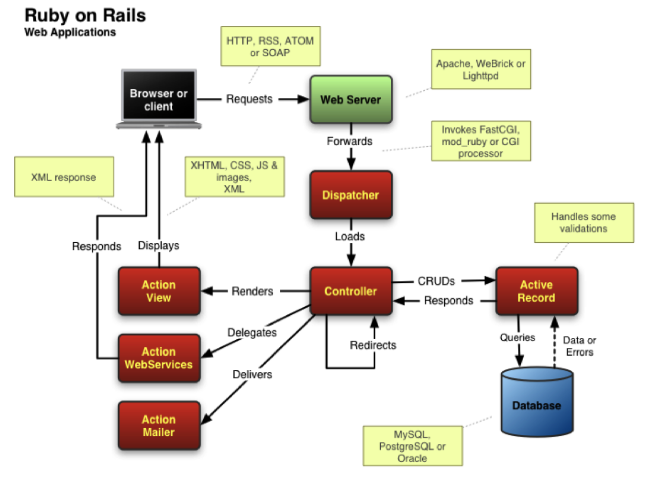

Este documento traz considerações, restrições e justificativas para a arquitetura do sistema.
Inspirado [neste template](http://www.utm.mx/~caff/doc/OpenUPWeb/openup/guidances/templates/architecture_notebook_BCD3507B.html), mas com muitas alterações devido à simplicidade de projeto.

Giovanni M Guidini - 16/0122660
Gabriel Bessa      - 16/0120811

- [Filosofia arquitetural](#filosofia-arquitetural)
- [Requerimentos relevantes para a arquitetura](#requerimentos-relevantes-para-a-arquitetura)
- [Estilo de arquitetura](#estilo-de-arquitetura)
    - [Observação](#observa%C3%A7%C3%A3o)
- [Visão Lógica da Arquitetura](#vis%C3%A3o-l%C3%B3gica-da-arquitetura)
- [Referências](#refer%C3%AAncias)
  
# Filosofia arquitetural

A filosofia arquitetural para este projeto será simplicidade. Será utilizada uma arquitetura simples de compreender e de implementar, preferencialmente uma arquitetura de referência que será reutilizada de um framework.

É importante ressaltar que ela deve poder ser utilizada sem grandes gastos (tempo e dinheiro), mas prover acesso ao sistema de máquinas diversas por meio da rede.

O ponto principal que move a escolha da arquitetura nesse sistema é o nível de conhecimento do time de desenvolvimento, e o tempo relativamente curto para a realização do trabalho.

# Requerimentos relevantes para a arquitetura

- Sistema deve estar disponível virtualmente o tempo todo
- Qualquer pessoa deve poder acessar o sistema por meio de um cliente web
- Os dados dos clientes cadastrados devem ser protegidos de acessos indevidos

# Estilo de arquitetura

Foi decidido reutilizar a arquitetura disponibilizada pela framework Rails. Esse framework apresenta uma arquitetura no estilo MVC (Model-View-Controller) como estilo arquitetural, mas cada um desses subsistemas é dividido em ainda outros módulos.

Para informações mais detalhadas sobre a arquitetura rails visite [este link](https://adrianmejia.com/ruby-on-rails-architectural-design/).

### Observação
A arquitetura descrita acima é a interna do Rails. Em verdade, para colocar o sistema em produção é necessário fazer uso de uma arquitetura do tipo Cliente-Servidor, com o sistema sendo um dos serviços providos por um servidor web.

# Visão Lógica da Arquitetura
Uma visão geral da arquitetura externa e interna do rails pode ser vista na figura abaixo (disponível [aqui](https://adrianmejia.com/images/rails_arch.png)).

# Referências

[1] Template: Architecture Notebook. OpenUP. http://www.utm.mx/~caff/doc/OpenUPWeb/openup/guidances/templates/architecture_notebook_BCD3507B.html

[2] Ruby on Rails Architetural Design. Adrian Mejia. https://adrianmejia.com/ruby-on-rails-architectural-design/