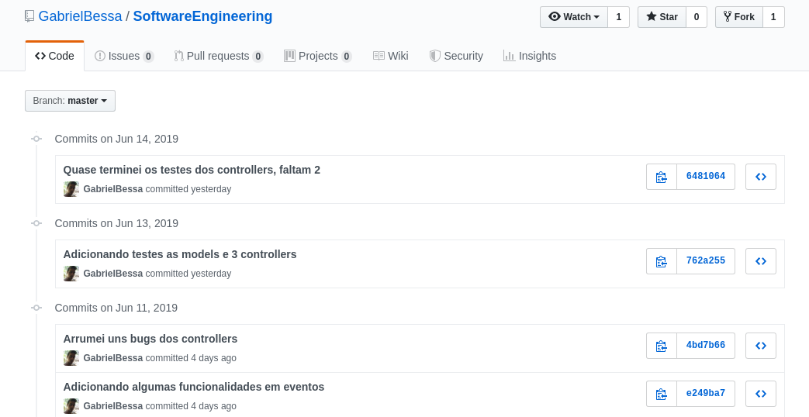

Este documento apresenta uma descrição do processo de controle de versões adotado para a realização do trabalho. Inicialmente é comentado brevemente o que é um sistema de controle de versões, e apresentada a ferramenta utilizada neste trabalho.

Em seguida, como foi organizado o controle de versões para este trabalho, e explicações do básico necessário para utilizar a ferramenta.

Giovanni M Guidini - 16/0122660
Gabriel Bessa      - 16/

- [Sistema de Controle de Versões](#sistema-de-controle-de-vers%C3%B5es)
- [Neste projeto](#neste-projeto)
- [Utilizando o Repositório Remoto](#utilizando-o-reposit%C3%B3rio-remoto)
  - [Obtendo uma cópia do projeto para alteração](#obtendo-uma-c%C3%B3pia-do-projeto-para-altera%C3%A7%C3%A3o)
- [Comprovação de Uso de Sistema de Controle de Versões](#comprova%C3%A7%C3%A3o-de-uso-de-sistema-de-controle-de-vers%C3%B5es)
- [Referências](#refer%C3%AAncias)
  
## Sistema de Controle de Versões

Posto de maneira simples, o controle de versão é um sistema que registra as mudanças feitas em um arquivo ou um conjunto de arquivos ao longo do tempo de forma que você possa recuperar versões específicas [1]. Ou seja, um sistema de controle de versão gerencia todas as mudanças feitas em um conjunto de arquivos.

Neste trabalho utilizamos a plataforma [GitHub](https://github.com/), que disponibiliza este serviço de controle de versões pela internet. Esta plataforma é muito conhecida e extensamente utilizada por desenvolvedores ao redor do mundo, estando disponível para o público desde 2007, e abrigando mais de 100 milhões de repositórios em 2018 [2].

## Neste projeto
Para o controle de versões deste projeto os 3 integrantes do grupo terão acesso a um repositório remoto no seguinte link: https://github.com/GabrielBessa/SoftwareEngineering.

Para o uso de tal repositório, o trabalho será dividido igualmente entre os integrantes do grupo para as tarefas serem bem feitas e bem coordenadas. Todos os integrantes terão igual privilégio de acesso a todo o repositório, tanto de leitura quanto de escrita.

## Utilizando o Repositório Remoto

Algumas operações básicas para utilização do controle de versões. Para mais informações consulte os [GitHub Guides](https://guides.github.com/).

### Obtendo uma cópia do projeto para alteração
Para obter uma cópia do repositório em sua máquina local, de maneira que possam ser feitas alterações, clone o repositório. Alternativamente você pode escolher fazer o download do repositório como um arquivo .zip diretamente do GitHub.

```git clone https://github.com/GabrielBessa/SoftwareEngineering.git```

### Salvando alterações locais
Para salvar alterações que você fez no repositório localmente, faça o commit das mudanças.

```git add . ```

```git commit -m "Mensagem de qual modificação foi feita"```

### Atualizando o repositório remoto
Para subir algo do trabalho que esteja atualizado, qualquer linha de código, ou documento atualizado, utilize o comando push.

```git push```

## Comprovação de Uso de Sistema de Controle de Versões
A lista completa de commits pode ser visualizada no [repositório](https://github.com/GabrielBessa/SoftwareEngineering) do projeto. Abaixo estão algumas capturas de tela mostrando parte do histórico de commits do sistema.

Histório de commits no repositório:


Histórico de commits locais (na máquina do desenvolvedor):


## Referências
[1] Git, Documentation. https://git-scm.com/book/pt-br/v1/Primeiros-passos-Sobre-Controle-de-Vers%C3%A3o.

[2] GitHub, About. https://github.com/about